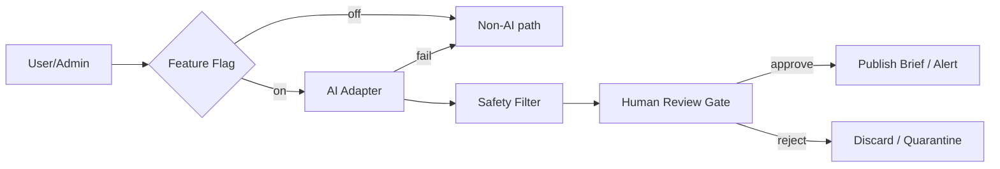

# AI System Design Principles

> Evidence: **DESIGNED**

## Principles

1. **Optional adapter** behind feature flag
2. **HITL mandatory** for RiskAlert and Brief publish
3. **Synchronous non-AI path** always available
4. **Provenance** on every AI output (AI-R2)
5. **Safety filter** before any user/admin-facing text (AI-R5)

## Adapter Interfaces (code)

- `BriefDraftAdapter` — draft only
- `RiskCandidateAdapter` — candidate only
- `NlSearchAdapter` — retrieval ranking
- `RecommendationAdapter` — explanation-only

Not wired into Servlet MVP.

## FastAPI Assistive Explain (v1)

Implemented endpoints (template-based, safety-filtered):

- `GET /health`
- `POST /v1/explain/fund`
- `POST /v1/explain/brief`
- `POST /v1/explain/risk`

Wired from Servlet via `AiClient`. Does not replace Non-AI path for core CRUD/read.
LLM BriefDraft / RiskCandidate adapters remain stubs behind OFF flags.
