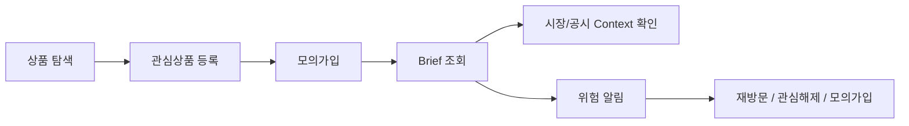

# Briefly — Product & Investment Context Analytics

> **관심상품 → 모의가입 → Brief 소비 → 위험 알림으로 이어지는 사용자 행동을 이벤트로 구조화하고, 재현 가능한 KPI와 Funnel 분석 모델로 전환한 Product Data Analytics 프로젝트**

## 1. Project Overview

Briefly는 금융상품 탐색 과정에서 사용자가 관심상품을 등록하고, 모의가입을 진행하고, Brief와 위험 알림을 확인하는 흐름을 가진 서비스입니다.

Data Analytics 영역에서는 단순 조회수 집계가 아니라,

```text
사용자 행동
    ↓
Event Tracking
    ↓
Validation
    ↓
Analytics Fact
    ↓
KPI / Funnel
    ↓
Segment Analysis
    ↓
Product Decision
```

구조로 서비스 행동 데이터를 분석할 수 있도록 설계했습니다.

### 핵심 구성

* GA4-style 사용자 행동 Event 6종 정의
* Raw / Validated Event 계층 분리
* Product Funnel 분석
* KPI Catalog 9개 정의
* Dimension 6개 / Fact 4개 Star Schema 설계
* SQL KPI View 구성
* Java 기반 KPI/Funnel 계산 로직
* 이벤트 Validation
* 사용자 ID SHA-256 + Salt 마스킹
* JUnit 기반 KPI·Funnel·Validation 테스트
* 외부 시세·공시 Context 연결 분석 설계

---

# 2. Business Problem

금융상품 서비스에서는 단순 방문자 수보다 사용자가 **어떤 정보를 확인한 뒤 다음 행동으로 이동했는지**를 파악하는 것이 중요합니다.

예를 들어 사용자가 상품을 조회했다는 사실만으로는 다음을 알기 어렵습니다.

* 상품에 실제 관심을 보였는가?
* 관심 등록 후 모의가입까지 이동했는가?
* Brief를 실제로 소비했는가?
* 위험 알림을 확인한 뒤 행동이 달라졌는가?
* 시장 데이터나 공시가 연결된 Brief에서 행동 차이가 있는가?

따라서 Briefly DA에서는 화면 단위 조회가 아니라 **사용자 행동 Event와 Product Funnel을 기준으로 분석 구조를 설계**했습니다.

---

# 3. User Journey

Briefly에서 분석하는 핵심 흐름은 다음과 같습니다.



핵심 Funnel:

```text
Explore
   ↓
Interest
   ↓
Mock Join
   ↓
Brief
```

이 흐름을 기준으로 사용자가 어느 단계에서 다음 행동으로 이동하는지 분석합니다.

---

# 4. Business Questions

## BQ-01. 관심상품 등록은 모의가입으로 이어지는가?

확인 지표:

* Interest Users
* Mock Join Users
* Interest → MockJoin Conversion Rate

```text
Interest → MockJoin CVR
=
MockJoin Users / Interest Users
```

상품별·위험등급별 전환 차이를 비교할 수 있도록 설계했습니다.

---

## BQ-02. 사용자는 Brief를 실제로 소비하는가?

확인 지표:

* Brief Views
* Active Users
* Brief View Rate

이를 통해 상품 탐색 이후 Brief가 실제 정보 소비 단계로 사용되는지 확인합니다.

---

## BQ-03. 위험 알림 이후 사용자의 행동은 달라지는가?

위험 알림 확인 이후 일정 기간을 기준으로 다음 행동을 분석합니다.

```text
Risk Alert View
      ↓
7-day Window
      ↓
Detail Revisit
Interest Remove
Mock Join Submit
```

이를 통해 위험 알림 이후 사용자 행동 패턴을 확인할 수 있습니다.

단, 관찰된 행동 차이를 위험 알림의 **인과 효과라고 단정하지 않습니다.**

---

## BQ-04. 시장·공시 Context가 연결된 Brief와 그렇지 않은 Brief에 행동 차이가 있는가?

Brief를 다음 두 Segment로 나눕니다.

```text
context_linked
context_unlinked
```

비교 후보:

* Brief View
* Detail Revisit
* Interest Remove
* Mock Join
* 체류 관련 지표

이 분석 역시 **Context 연결 여부와 사용자 행동 간 상관관계 비교**로 한정합니다.

---

## BQ-05. 시장 변동성과 관심 해제 행동에는 관련성이 있는가?

시장 데이터의 `change_rate`를 구간화하여 사용자 `interest_remove` 행동과 비교합니다.

```text
Market Change Rate
        ↓
Volatility Bucket
        ↓
Interest Remove Rate
```

추후 충분한 데이터가 확보되면 Pearson 또는 Spearman 상관분석으로 확장할 수 있습니다.

---

# 5. Event Taxonomy

사용자 행동을 분석 가능한 Event 단위로 정의했습니다.

| Event                  | 의미               | 주요 Parameter                             |
| ---------------------- | ---------------- | ---------------------------------------- |
| `product_interest_add` | 관심상품 등록          | product_id, security_id, source          |
| `mock_join_submit`     | 모의가입 신청          | product_id, amount, risk_ack             |
| `brief_view`           | Brief 조회         | brief_id, product_id, has_market_context |
| `risk_alert_view`      | 위험 알림 확인         | signal_id, product_id                    |
| `interest_remove`      | 관심상품 해제          | product_id, reason                       |
| `market_context_view`  | 시장/공시 Context 조회 | security_id, base_date                   |

Event는 다음 경로를 거칩니다.

```text
Client / Service
        ↓
raw_event
        ↓
Event Validation
        ↓
validated_event
        ↓
fact_user_engagement
        ↓
KPI / Funnel
```

---

# 6. Event Quality & Validation

잘못된 Event가 분석 결과를 왜곡하지 않도록 Validation 규칙을 정의했습니다.

예를 들어:

```text
event_id
→ 필수

user_id_hash
→ SHA-256 64자리

product_interest_add
→ product_id 필수

mock_join_submit
→ product_id 필수
→ amount > 0

market_context_view
→ security_id 필수
```

잘못된 Event는 분석 Mart에 바로 반영하지 않고 별도 검증 대상으로 취급하는 구조입니다.

---

# 7. Event Idempotency

동일 Event가 네트워크 재전송 등으로 여러 번 수집될 경우 KPI가 중복 집계될 수 있습니다.

따라서:

```text
event_id = PRIMARY KEY / UNIQUE
```

를 기본 식별자로 사용합니다.

보조적으로 다음 조합도 중복 검증 기준으로 사용할 수 있도록 설계했습니다.

```text
event_ts
+ user_id_hash
+ event_name
+ payload hash
```

이를 통해 동일 Event 재전송으로 인한 중복 집계를 줄일 수 있습니다.

---

# 8. KPI Catalog

분석 지표는 코드나 Dashboard에 직접 수식을 흩어두지 않고 별도의 KPI 계약으로 정의했습니다.

| KPI                            | Formula                                 | Grain         |
| ------------------------------ | --------------------------------------- | ------------- |
| Interest → MockJoin Conversion | `mock_joins / interests`                | day / product |
| Brief View Rate                | `brief_views / active_users`            | day           |
| Alert Conversion               | `post_alert_actions / alerts_sent`      | day           |
| Market Data Coverage           | `products_with_price / active_products` | day           |
| Security Master Match Rate     | `matched / mapping_targets`             | day           |
| Disclosure Coverage            | `companies_with_disclosure / tracked`   | week          |
| Source Freshness               | `analysis_ts - source_reference_date`   | day           |
| Brief Evidence Coverage        | `briefs_with_external / total_briefs`   | week          |
| Risk Signal Review Rate        | `reviewed / generated`                  | week          |

---

# 9. KPI Formula Versioning

지표 정의가 변경되면 동일한 KPI 이름이라도 과거 값과 현재 값의 의미가 달라질 수 있습니다.

이를 방지하기 위해 다음 Metadata를 정의했습니다.

```text
metric_code
formula_version
formula_text
effective_from
```

예:

```text
metric_code      = interest_mockjoin_cvr
formula_version  = 1.0.0
```

목표는 동일한 입력 데이터와 동일한 Formula Version에 대해 항상 같은 결과를 재현할 수 있도록 하는 것입니다.

---

# 10. Null / Unknown Policy

분석에서 `0`과 `알 수 없음`을 구분합니다.

예를 들어 분모가 0인 경우:

```text
MockJoin / Interest
```

에서 관심 등록 사용자가 한 명도 없다면 전환율을 `0%`라고 표시하지 않습니다.

```text
denominator = 0
        ↓
KPI = NULL
        ↓
Report = N/A
```

Context가 연결되지 않은 경우도 데이터를 임의로 제외하지 않고:

```text
context_unlinked
```

라는 별도 Segment로 유지합니다.

---

# 11. Analytics Star Schema

분석용 데이터 모델은 사용자 행동 Fact를 중심으로 Dimension과 외부 Context Fact를 연결하도록 설계했습니다.

## Dimensions

| Dimension      | 역할              |
| -------------- | --------------- |
| `dim_date`     | 일·월·주 기준 분석     |
| `dim_product`  | 상품, 위험등급, 상태    |
| `dim_security` | 종목 식별정보         |
| `dim_company`  | 기업·법인 기준정보      |
| `dim_user`     | 익명화 사용자 Segment |
| `dim_status`   | 신청·Signal 상태    |

---

## Facts

| Fact                    | Grain                |
| ----------------------- | -------------------- |
| `fact_user_engagement`  | Event × User × Day   |
| `fact_market_snapshot`  | Security × Base Date |
| `fact_disclosure_event` | Company × Disclosure |
| `fact_risk_signal`      | Signal × Day         |

핵심 분석 Fact는 `fact_user_engagement`입니다.

```text
event_id
date_key
user_id_hash
product_id
security_id
event_name
has_market_context
context_segment
amount
event_ts
```

---

# 12. External Context

Briefly의 사용자 행동 데이터만으로 시장 상황까지 설명하지 않습니다.

외부 Context는 Data Engineering 영역에서 공급받는 별도 Fact로 연결합니다.

```text
User Engagement
      │
      ├──────────────┐
      ↓              ↓
Market Snapshot    Disclosure
```

### Market Context

```text
security_id
base_date
close_price
change_rate
source_reference_date
fetched_at
source_url
```

### Disclosure Context

```text
corp_code
rcept_no
reference_date
report_name
source_url
fetched_at
```

외부 데이터에는 기준일과 수집 시점, 출처 URL을 남겨 **어느 시점의 정보를 기준으로 분석했는지 추적 가능하도록 설계**했습니다.

---

# 13. Context Analysis

Brief 조회 Event에는 시장 Context 연결 여부를 저장합니다.

```text
has_market_context = true
      ↓
context_linked

has_market_context = false
      ↓
context_unlinked
```

이를 통해 다음과 같은 Segment 비교가 가능합니다.

```text
context_linked
      VS
context_unlinked
```

단,

> Context가 연결된 Brief에서 높은 전환율이 관찰되었다고 해서 Context가 전환율 상승의 원인이라고 단정하지 않습니다.

이 프로젝트의 현재 분석 범위는 **Correlation Analysis**입니다.

---

# 14. Funnel Analysis

Java의 `FunnelAnalyzer`에서는 사용자 단위로 각 Funnel Stage를 계산합니다.

```text
Explore
Interest
Mock Join
Brief
```

각 Stage는 단순 Event 수가 아니라 **Distinct User 기준**으로 계산합니다.

예:

```text
Interest Users = 100
Mock Join Users = 40

Interest → MockJoin Rate
= 40 / 100
= 40%
```

`from` 단계 사용자가 0명인 경우 잘못된 `0%`를 반환하지 않고 계산 불가 상태로 처리합니다.

---

# 15. KPI Calculation

`KpiCalculator`에서는 검증된 Event를 기반으로 다음 지표 계산 로직을 구현했습니다.

* Interest → MockJoin Conversion
* Brief View Rate
* Market Data Coverage
* Brief Evidence Coverage
* Risk Signal Review Rate

예를 들어 관심→모의가입 Conversion은:

```text
특정 날짜 + 특정 상품
        ↓
Event Filtering
        ↓
Distinct Interest Users
Distinct MockJoin Users
        ↓
MockJoin / Interest
```

순서로 계산합니다.

---

# 16. SQL KPI Views

SQL에서도 주요 KPI를 동일한 분석 정의로 조회할 수 있도록 View를 설계했습니다.

현재 정의된 View:

```text
v_kpi_interest_mockjoin_cvr
v_kpi_brief_view_rate
v_kpi_market_data_coverage
v_kpi_brief_context_segment
```

예를 들어:

```sql
SELECT *
FROM v_kpi_interest_mockjoin_cvr;
```

를 통해 일자·상품·위험등급별 관심→모의가입 Conversion을 조회할 수 있습니다.

---

# 17. Privacy

사용자 행동 분석에서 원본 사용자 ID를 Analytics 영역에 직접 저장하지 않습니다.

```text
Raw User ID
      ↓
Salt
      ↓
SHA-256
      ↓
user_id_hash
```

Java `UserIdMasker`를 통해 SHA-256 + Salt 방식으로 분석용 ID를 생성하도록 구성했습니다.

Analytics Layer에서는 다음 형태만 사용합니다.

```text
user_id_hash
```

이 프로젝트에서 사용자 행동 분석과 개인 식별정보를 가능한 한 분리하는 것을 기본 원칙으로 두었습니다.

---

# 18. Reproducible Test Evidence

현재 Repository에서는 실제 운영 사용자 데이터를 성과처럼 사용하지 않습니다.

대신 Unit Test fixture로 KPI 계산 로직을 검증합니다.

### KPI Calculation Test

테스트 입력:

```text
Interest User A
Interest User B
MockJoin User A
```

계산:

```text
Interest Users = 2
MockJoin Users = 1

Conversion
= 1 / 2
= 0.500000
```

예상 결과:

```text
50%
```

이 값은 **실서비스 Conversion Rate가 아니라 KPI 계산 로직을 검증하기 위한 테스트 데이터 결과**입니다.

---

### Funnel Test

한 테스트 사용자가:

```text
Interest
 → Mock Join
 → Brief View
```

를 순서대로 수행하는 fixture를 사용합니다.

결과:

```text
Explore Users   = 1
Interest Users  = 1
MockJoin Users  = 1
Brief Users     = 1
```

Interest → MockJoin Stage Rate는 테스트 조건에서 `1.0`으로 검증합니다.

역시 실제 서비스 성과가 아니라 **분석 로직 재현성 검증용 fixture**입니다.

---

# 19. Analysis Scenarios

## Scenario 1 — Product Funnel

```text
Product Explore
      ↓
Interest Add
      ↓
Mock Join
      ↓
Brief View
```

상품·위험등급별 Funnel Drop-off를 확인합니다.

---

## Scenario 2 — Brief Context Segment

```text
Brief View
    ↓
┌───────────────┐
│               │
Context       Context
Linked        Unlinked
│               │
└──────┬────────┘
       ↓
Behavior Compare
```

Brief Context 연결 여부에 따른 사용자 행동 차이를 비교합니다.

---

## Scenario 3 — Post Alert Behavior

```text
Risk Alert View
      ↓
7 Days
      ↓
Detail Revisit
Interest Remove
Mock Join
```

위험 Signal을 확인한 사용자의 후속 행동을 Segment별로 분석합니다.

---

## Scenario 4 — Market Volatility

```text
Market Snapshot
      ↓
Change Rate Bucket
      ↓
User Behavior
      ↓
Correlation Analysis
```

시장 변동 구간별 관심 해제율 등을 비교하되 인과관계로 해석하지 않습니다.

---

# 20. Tech Stack

| Category                 | Stack                         |
| ------------------------ | ----------------------------- |
| Language                 | Java 17                       |
| Query                    | SQL                           |
| Database Modeling        | Star Schema                   |
| Build                    | Maven                         |
| Testing                  | JUnit 5                       |
| Analytics Design         | Event Taxonomy / Funnel / KPI |
| Privacy                  | SHA-256 + Salt                |
| External Context         | Market / Disclosure DE Mart   |
| Planned BI               | Power BI                      |
| Planned Event Collection | GA4 Measurement Protocol      |

---

# 21. Repository Structure

```text
da/
├── README.md
│
├── docs/
│   ├── KPI_CATALOG.md
│   ├── EVENT_TAXONOMY.md
│   ├── STAR_SCHEMA.md
│   └── ANALYSIS_DESIGN.md
│
├── sql/
│   ├── 01_raw_event.sql
│   ├── 02_dimensions.sql
│   ├── 03_facts.sql
│   └── 04_kpi_views.sql
│
├── src/
│   ├── main/java/com/briefly/da/
│   │   ├── event/
│   │   ├── funnel/
│   │   ├── kpi/
│   │   └── privacy/
│   │
│   └── test/java/com/briefly/da/
│       ├── event/
│       ├── funnel/
│       ├── kpi/
│       └── privacy/
│
└── pom.xml
```

---

# 22. How to Test

```bash
cd da
mvn test
```

현재 테스트 범위:

```text
Event Validation
Funnel Calculation
KPI Calculation
User ID Masking
```

---

# 23. Current Evidence

포트폴리오에서는 설계한 것과 실제 검증한 것을 구분합니다.

| Area                         | Status                    |
| ---------------------------- | ------------------------- |
| Event Taxonomy               | Designed                  |
| Event Validation Java Logic  | Implemented + Unit Tested |
| KPI Catalog                  | Designed                  |
| KPI Java Calculator          | Implemented + Unit Tested |
| Funnel Analyzer              | Implemented + Unit Tested |
| User ID Masking              | Implemented + Unit Tested |
| Star Schema DDL              | Designed                  |
| KPI SQL Views                | Designed                  |
| External Market Context Join | Designed / Not E2E Tested |
| GA4 Measurement Protocol     | Planned                   |
| BI Dashboard                 | Planned                   |
| Production Event Stream      | Not Tested                |
| Real-user KPI Report         | Not Available             |

실제로 검증되지 않은 Production 지표나 Dashboard 성과는 구현 결과처럼 표현하지 않습니다.

---

# 24. What I Focused On

이 프로젝트의 Data Analytics 영역에서는 단순히 SQL Query를 작성하는 것보다 다음 흐름을 만드는 데 집중했습니다.

```text
Business Question
      ↓
User Event
      ↓
Metric Definition
      ↓
Data Model
      ↓
Validation
      ↓
KPI Calculation
      ↓
Funnel / Segment
      ↓
Interpretation
      ↓
Product Action
```

특히 분석 지표가 코드·SQL·Dashboard마다 서로 다른 의미가 되지 않도록 **KPI의 Formula, Grain, Segment, Version을 먼저 정의**했습니다.

또한 시장 데이터와 사용자 행동을 함께 분석하더라도 상관관계를 인과관계로 과장하지 않고, Context 미연결 데이터도 제거하지 않고 별도 Segment로 관리하도록 설계했습니다.

---

# 25. Next Steps

현재 구조에서 다음 단계로 확장할 수 있습니다.

```text
Application Events
       ↓
Event Collection
       ↓
Validated Event
       ↓
Analytics Star Schema
       ↓
KPI Views
       ↓
Python / Statistical Analysis
       ↓
Power BI Dashboard
       ↓
Product Experiment
```

확장 후보:

* 실제 Event 수집 연동
* Funnel Drop-off Dashboard
* Product / Risk Level Segment 분석
* Cohort Analysis
* Post-Alert 7-day Behavior 분석
* Context Linked vs Unlinked 분석
* 시장 변동성 상관분석
* Source Freshness Monitoring
* Power BI Dashboard
* KPI Regression Test 자동화

---

# Summary

**Briefly DA는 금융상품 서비스의 관심등록·모의가입·Brief 소비·위험 알림 행동을 Event 단위로 구조화하고, 이를 Funnel·KPI·Star Schema로 연결해 사용자 행동과 외부 금융 Context를 재현 가능하게 분석할 수 있도록 설계한 Product Data Analytics 프로젝트입니다.**

현재는 Event/KPI/Funnel 계산과 Privacy 처리 로직을 Java Unit Test로 검증했으며, Star Schema와 KPI SQL View를 설계했습니다. 실제 Production Event와 Dashboard가 없는 영역은 성과로 과장하지 않고 명확히 구분합니다.
